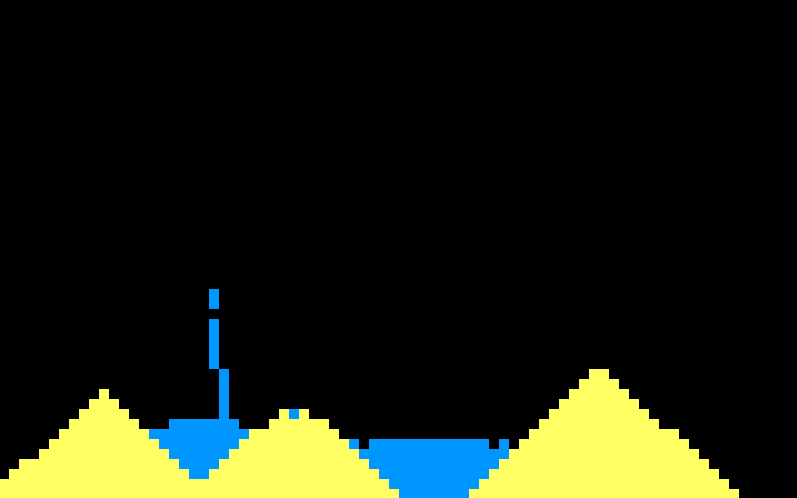

# falling-sand-go
## Preview

This is a falling sand game created in Go for practice purposes. The game currently includes sand and water elements. The simulation uses the Ebitengine library to render and update the elements on the screen.